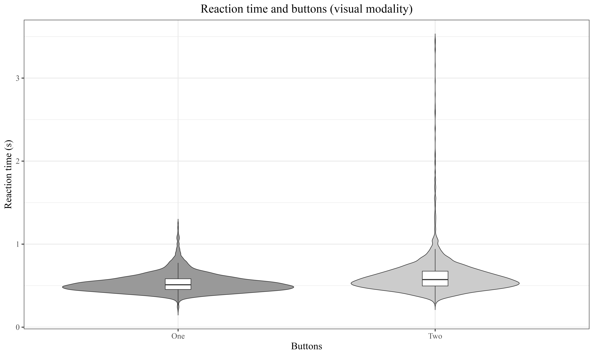
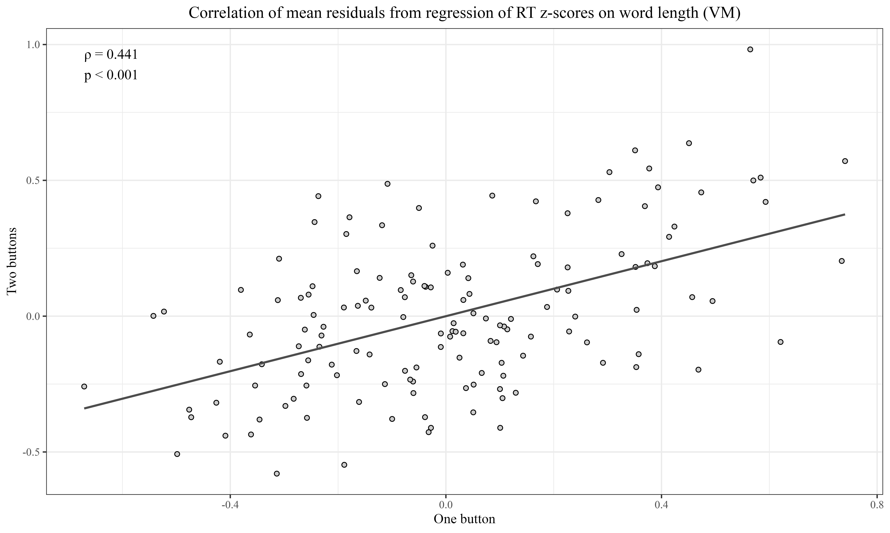
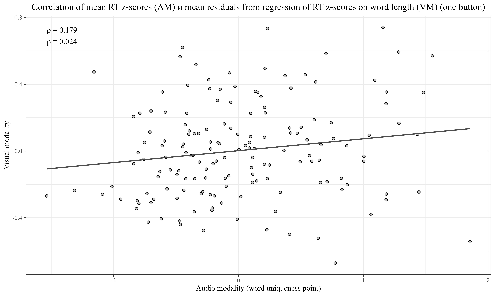
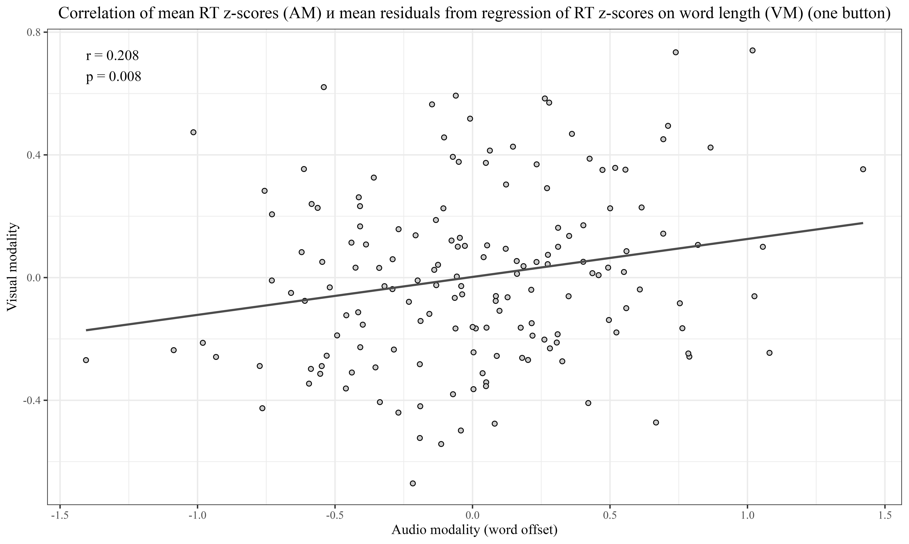
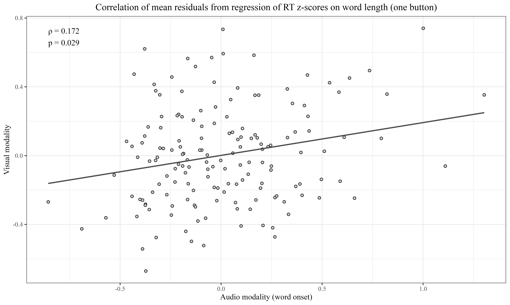

# Visual vs Auditory Lexical Decision in Russian: Button Matters
The data and code for two Russian lexical decision task experiments in visual and auditory modalities in one-button design

## Relevance and Research Objective
The Lexical Decision Task (LDT) is a well-established method for investigating the mental lexicon. However, the traditional two-button design (LDT-b) may introduce additional cognitive load, particularly for children and neurodivergent individuals. This study experimentally tested the hypothesis that a one-button design (LDT-c) simplifies task performance relative to LDT-b, in both visual (VM) and auditory (AM) modalities.

## Methodology
We compared results from four experiments with native Russian speakers: two in VM and two in AM, using both the LDT-b design (based on *Author, 2025* \[Title omitted for blind review\]) and the new LDT-c design. Identical sets of words and pseudowords (160 items each) were used across experiments. Data were analyzed using linear and generalized linear mixed-effects models, along with correlation analysis. Statistical analysis was conducted in R:
- `code/4.2_4.3_button_visual.R`: does regression and correlation analysis of words RT in VM
- `code/4.4_4.5_errors_analysis.R`: analyzes effets of the number of buttons and modality on the number of errors
- `code/4.6_correlations.R`: conducts correlation analysis of words in VM and AM in one-button design

## Data (one-button design)
The repository includes two data files:
1. `data/audio_data.csv`: entries in AM
- `Index`: participant's ID
- `Age`: participant's age
- `Gender`: participant's gender
- `Word`: stimulus
- `If_word`: `"yes"` if the stimulus is a real word, `"no"` if it is a pseudoword
- `Decision`: `"space"` if the button was pressed, `NA` otherwise
- `Answer`: correctness of answer (`"right"` or `"wrong"`)
- `RT`: reaction time (s)
- `Word_length`: word duration (s)
- `Uniqueness_point`: uniqueness point (duration of the unique part; total length if no such part; `NA` for pseudowords (as it is not needed in this design))

2. `data/visual_data.csv`: entries in VM
- `Index`: participant's ID
- `Age`: participant's age
- `Gender`: participant's gender
- `Word`: stimulus
- `If_word`: `"yes"` if the stimulus is a real word, `"no"` if it is a pseudoword
- `Decision`: `"space"` if the button was pressed, `NA` otherwise
- `Answer`: correctness of answer (`"right"` or `"wrong"`)
- `RT`: reaction time (s)
- `Word_length`: number of symbols in stimulus

## Results
In the visual modality, reaction times (RT) were significantly lower for LDT-c than for LDT-b, with a mean reduction of 84 ms. Error rates were significantly lower in LDT-c for both visual and auditory modalities. Regarding cross-modal correlations, a weak but significant correlation between RT in VM and AM was found for LDT-c, but not for LDT-b. The distribution of error types (false negatives vs. false positives) did not vary by button format; however, more errors overall occurred in the auditory modality.

## Conclusions and Implications
The LDT-c design demonstrates a statistically supported simplifying effect, yielding faster responses and fewer errors than LDT-b. These findings support its use in research involving children, individuals with autism spectrum disorder (ASD), and other groups where minimizing cognitive load is essential. The results also justify adopting LDT-c for megastudies and for developing Russian-language lexical decision databases.

## Infographics
- RT in LDT-b and LDT-c
  

- Correlation of mean residiuals from regression of RT z-scores on word length (VM)
  

- Correlation of mean RT z-scores (AM) and mean residiuals from regression of RT z-scores on word length (VM) in one-button design calculated from word uniqueness point
  

- Correlation of mean RT z-scores (AM) and mean residiuals from regression of RT z-scores on word length (VM) in one-button design calculated from word offset
  

- Correlation of mean RT z-scores (AM) and mean residiuals from regression of RT z-scores on word length (VM) in one-button design calculated from word onset
  
